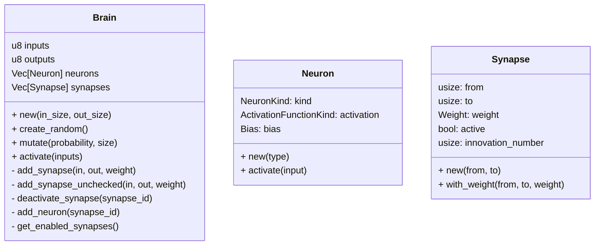

# Brain Component

The brain component models the brain in the simulation.

```mermaid
classDiagram
    class Brain {
        u8 inputs
        u8 outputs
        Vec[Neuron] neurons
        Vec[Synapse] synapses

        + new(in_size, out_size)
        + create_random()
        + mutate(probability, size)
        + activate(inputs)

        - add_synapse(in, out, weight)
        - add_synapse_unchecked(in, out, weight)
        - deactivate_synapse(synapse_id)
        - add_neuron(synapse_id)
        - get_enabled_synapses()
    }

    class Neuron {
        NeuronKind: kind
        ActivationFunctionKind: activation
        Bias: bias

        + new(type)
        + activate(input)
    }

    class Synapse {
        usize: from
        usize: to
        Weight: weight
        bool: active
        usize: innovation_number

        + new(from, to)
        + with_weight(from, to, weight)
    }
```
